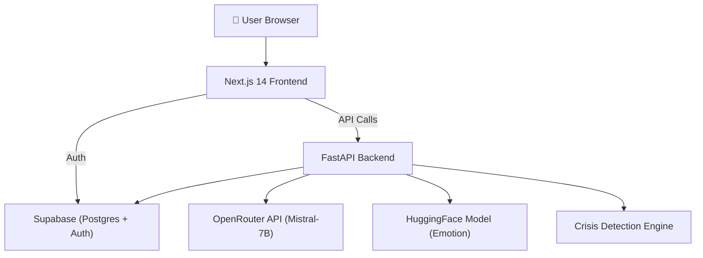

# 🧠 MindMitra – AI Mental Health Companion

> **A supportive AI companion that listens empathetically, tracks your mood, and helps you with coping strategies.**  
> ⚠️ **Not a therapist or medical tool** — a caring emotional companion with crisis detection and ethical safeguards.


---

## ✨ Features

| Feature | Description |
|---------|-------------|
| 💬 **Empathetic Chat** | AI-powered conversations that validate emotions and ask reflective questions |
| 🎭 **Emotion Detection** | Real-time emotion analysis using HuggingFace transformers (7 emotions) |
| 🆘 **Crisis Detection** | Hybrid keyword + emotion-threshold safety system with helpline info |
| 📊 **Mood Dashboard** | Recharts-powered analytics with pie charts and trend lines |
| 🧘 **Coping Suggestions** | Emotion-mapped coping strategies (breathing, journaling, grounding, etc.) |
| 📝 **Reflection Journal** | Private journaling space with writing prompts |
| 🔐 **Auth** | Supabase email/password + Google OAuth |
| 📱 **Responsive** | Mobile-first dark mode UI with glassmorphism design |

---

## 🏗️ Architecture



---

## 📁 Project Structure

```
mindmitra-ai/
├── backend/                    # FastAPI Python backend
│   ├── main.py                 # App entry point (CORS, routes, rate limiting)
│   ├── config.py               # Pydantic settings (env vars)
│   ├── db.py                   # Supabase client + DB helpers
│   ├── emotion.py              # HuggingFace emotion detection
│   ├── crisis.py               # Crisis/self-harm detection
│   ├── llm.py                  # OpenRouter LLM integration
│   ├── routes/
│   │   ├── chat.py             # POST /chat endpoint
│   │   └── mood.py             # GET /mood/{user_id} endpoint
│   ├── requirements.txt
│   ├── Procfile                # Render deployment
│   └── .env.example
│
├── frontend/                   # Next.js 14 TypeScript frontend
│   ├── src/
│   │   ├── app/
│   │   │   ├── layout.tsx      # Root layout (dark mode, fonts)
│   │   │   ├── page.tsx        # Landing page
│   │   │   ├── login/page.tsx  # Auth page
│   │   │   ├── chat/page.tsx   # Chat interface
│   │   │   ├── dashboard/page.tsx  # Mood analytics
│   │   │   └── journal/page.tsx    # Reflection journal
│   │   ├── components/
│   │   │   ├── Navbar.tsx
│   │   │   ├── ChatBubble.tsx
│   │   │   ├── TypingIndicator.tsx
│   │   │   ├── CrisisModal.tsx
│   │   │   ├── CopingSuggestions.tsx
│   │   │   └── MoodCheckIn.tsx
│   │   └── lib/
│   │       ├── supabase.ts     # Supabase client
│   │       └── api.ts          # Backend API helpers
│   └── .env.example
│
├── supabase/
│   └── migrations.sql          # Database schema + RLS policies
├── .gitignore
└── README.md
```

---

## 🚀 Setup Instructions

### Prerequisites
- **Node.js** ≥ 18
- **Python** ≥ 3.10
- **OpenRouter account** (free) → [openrouter.ai](https://openrouter.ai)
- **Supabase account** (free) → [supabase.com](https://supabase.com)

---

### 1️⃣ Supabase Setup (Step-by-Step)

1. Go to [supabase.com](https://supabase.com) and **sign up / log in**
2. Click **"New Project"**
3. Choose an organization (or create one)
4. Set a **project name** (e.g., `mindmitra`) and a **database password**
5. Select a **region** close to you → click **"Create new project"**
6. Wait for the project to provision (~2 minutes)

**Get your keys:**
7. Go to **Settings → API** in the sidebar
8. Copy these values:
   - **Project URL** → `https://xxxxx.supabase.co`
   - **anon public key** → starts with `eyJ...`
   - **service_role key** → starts with `eyJ...` (keep this secret!)

**Run the migration:**
9. Go to **SQL Editor** in the sidebar
10. Click **"New Query"**
11. Copy the contents of `supabase/migrations.sql` and paste it
12. Click **"Run"** → all tables and policies will be created ✅

**Enable Google Auth (optional):**
13. Go to **Authentication → Providers**
14. Enable **Google** provider
15. Add your Google OAuth credentials (from [Google Cloud Console](https://console.cloud.google.com))

---

### 2️⃣ Backend Setup

```bash
# Navigate to backend
cd backend

# Create virtual environment
python -m venv venv
venv\Scripts\activate       # Windows
# source venv/bin/activate  # macOS/Linux

# Install dependencies
pip install -r requirements.txt

# Create .env from template
copy .env.example .env      # Windows
# cp .env.example .env      # macOS/Linux

# Edit .env with your actual keys:
# OPENROUTER_API_KEY=sk-or-...
# SUPABASE_URL=https://xxxxx.supabase.co
# SUPABASE_KEY=eyJ...
# SUPABASE_SERVICE_KEY=eyJ...

# Start the server
uvicorn main:app --reload
```

Server will start at **http://localhost:8000**  
API docs at **http://localhost:8000/docs** 📖

> ⚠️ First startup downloads the emotion model (~320 MB). Be patient!

---

### 3️⃣ Frontend Setup

```bash
# Navigate to frontend
cd frontend

# Install dependencies
npm install

# Create .env.local from template
copy .env.example .env.local      # Windows
# cp .env.example .env.local      # macOS/Linux

# Edit .env.local:
# NEXT_PUBLIC_SUPABASE_URL=https://xxxxx.supabase.co
# NEXT_PUBLIC_SUPABASE_ANON_KEY=eyJ...
# NEXT_PUBLIC_API_URL=http://localhost:8000

# Start dev server
npm run dev
```

Frontend will start at **http://localhost:3000** 🎨

---

## 🌐 Deployment

### Backend → Render (Free)

1. Push code to GitHub
2. Go to [render.com](https://render.com) → **New Web Service**
3. Connect your GitHub repo
4. Settings:
   - **Root Directory**: `backend`
   - **Build Command**: `pip install -r requirements.txt`
   - **Start Command**: `uvicorn main:app --host 0.0.0.0 --port $PORT`
5. Add environment variables from `.env`
6. Deploy!

### Frontend → Vercel (Free)

1. Go to [vercel.com](https://vercel.com) → **Import Project**
2. Connect your GitHub repo
3. Settings:
   - **Root Directory**: `frontend`
   - **Framework**: Next.js
4. Add environment variables:
   - `NEXT_PUBLIC_SUPABASE_URL`
   - `NEXT_PUBLIC_SUPABASE_ANON_KEY`
   - `NEXT_PUBLIC_API_URL` → your Render backend URL
5. Deploy!

---

## 🔐 Security & Ethics

- ✅ Environment variables for all secrets
- ✅ Rate limiting (60 req/min via SlowAPI)
- ✅ Input sanitization & max length validation (2000 chars)
- ✅ Supabase Row Level Security (RLS)
- ✅ Crisis-safe response handling with helpline info
- ✅ Ethics disclaimer on every page
- ⚠️ **This is NOT a medical device or therapist**

---

## 🛠️ Tech Stack

| Layer | Technology |
|-------|-----------|
| Frontend | Next.js 14, TypeScript, Tailwind CSS |
| Backend | FastAPI, Python |
| LLM | OpenRouter (Mistral-7B-Instruct) |
| Emotion AI | HuggingFace Transformers (DistilRoBERTa) |
| Database | Supabase (PostgreSQL) |
| Auth | Supabase Auth (Email + Google) |
| Charts | Recharts |
| Deployment | Vercel (frontend) + Render (backend) |

---

## ❓ Troubleshooting

### Login Error: "Email not confirmed"
By default, Supabase requires you to verify your email address before logging in.
**Fix for development:**
1. Go to your **Supabase Dashboard** → **Authentication** → **Providers** → **Email**
2. Toggle **OFF** "Confirm email"
3. Click **Save**
4. Sign up again with a new email (or delete the old user in **Authentication** → **Users** and sign up again)

---

## 📜 License

MIT License — free to use, modify, and distribute.

---

<p align="center">
  Built with 💜 for mental health awareness<br/>
  <em>Remember: It's okay to not be okay. Help is always available.</em>
</p>
